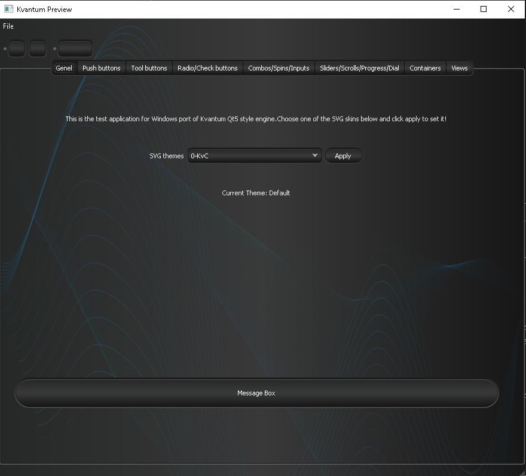

 Qt5 Dark Theme for Win10 😎🤘🏻
==============================


Qt5 style engine + several dark themes for Windows 10. Tehnically this is a Kvantum Qt5 style engine port for Windows. Currently a bit hacky, use at your own risk.

<p align="center"><br>Theme (Glow Dark) preview</p>


Build instructions 👨🏼‍💻
---------------------------
Current build is based on Qt5 5.15.2 and Microsoft Visual Studio 2019 and CMake.<br>
Your Qt5 is expected to be installed into C:/Qt5/5.15.2/msvc2019_64

```
$ git clone https://github.com/ensisoft/Qt5-dark-theme
$ cd Qt5-dark-theme
$ mkdir build
$ cd build
$ cmake -G "Visual Studio 16 2019" .. -DCMAKE_BUILD_TYPE=Release
$ cmake --build . --config Release
$ cmake --install . --config Release
$ bin/Test.ext
```


Usage 📔
---------------------------
The default Kvantum theme is built into the library with all the resources included so that in order to use that no runtime (.svg etc file resources) are needed! Having the .dll library is engouh!

Qt looks for style plugins inside your applications styles/ folders.  You should be able to drop Kvantum.dll there once you've built it and it should just work as long as you make your Qt5 app to actually use the style.
There are two ways to ask Qt to use the style.

- Pass '-style' command line parameter at your application startup
- Call QApplication::setStyle("kvantum") or QApplication::setStyle("kvantum-dark")

You should also be able to use your preferred svg theme and build it into the library if you prefer to do so. Basically easiest solution should be to copy the themes .kvconfig and .svg file into default/ and overwrite the original files and rebuild the library.


Thanks 🙏
------------

Thanks to @Tsujan for the original Kvantum engine and @celibol for the initial Windows port.

